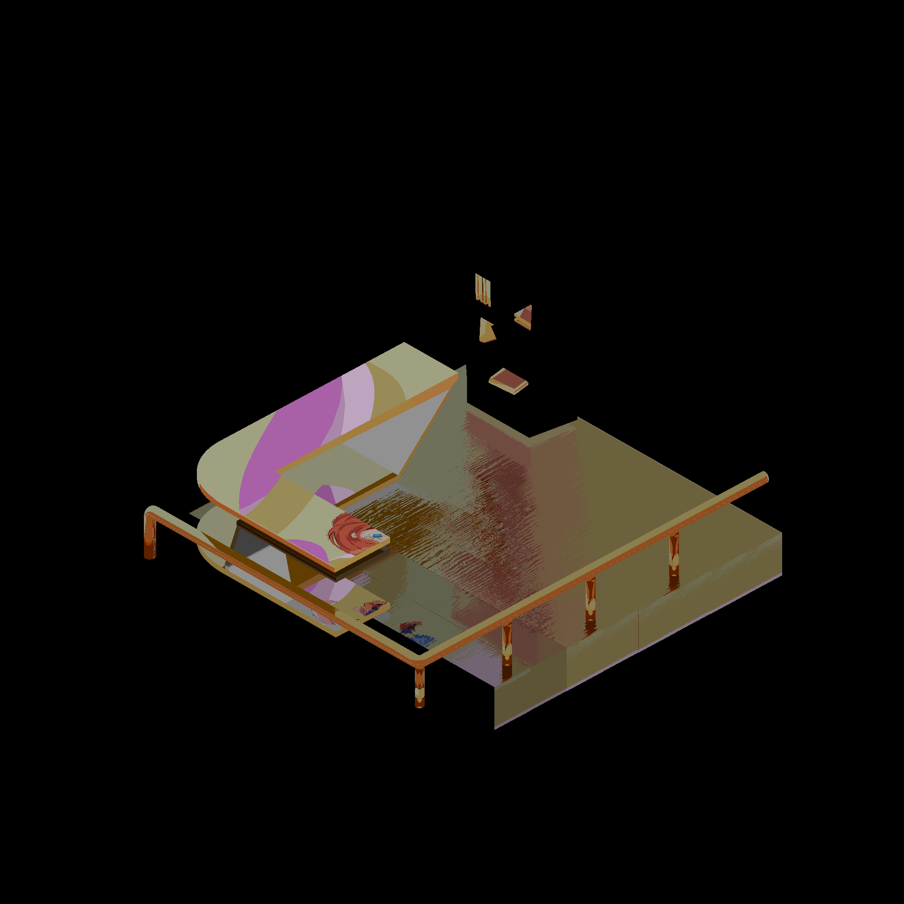

# Unigma Engine

A custom renderer built for Unity which includes a number of features. This repo should contain all the following (somewhere in the code I guess)

| **Composite**                                      |
|---------------------------------------------------|
|  |

| **Fluid Simulation**                              |
|---------------------------------------------------|
|  |
|  |
|  |

| **ReSTIR**                                        |
|---------------------------------------------------|
|  |

| **SVGF**                                          |
|---------------------------------------------------|
|  |

| **RTX Ray Traced Reflections**                    |
|---------------------------------------------------|
|  |

